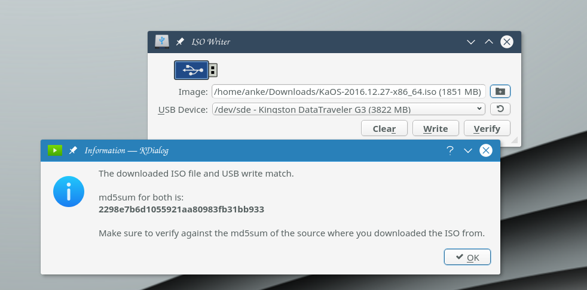
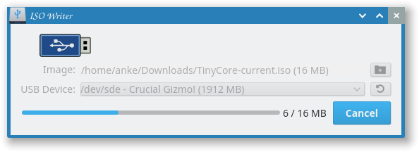

# isowriter

## Description
This tool is designed for creating bootable USB flash disks with by dumping the [KaOS](https://kaosx.us) distribution ISO image file contents to the flash disk. It might also work the same way for other Linux (or non-Linux) distributions, but there is no guarantee since the image must be prepared for such use.

The tool is distributed under the GPL v3 license which terms and conditions you can find in the file LICENSE.html, and is forked from [ROSA Image Writer](https://abf.io/soft/rosa-imagewriter)

Copyright © 2016 ROSA

Copyright © 2016 demm@kaosx.us

Developed by: Konstantin Vlasov <konstantin.vlasov@rosalab.ru>, NTC IT ROSA LLC

## Usage

**Warning!** This tool deletes all the data on the selected USB device, including the partition table (if any), so please be careful and check your actions twice!

The application requires direct access to the physical device, so when you start it, automatically request for Administrator/root privileges will appear. The application's main window looks like follows:





You need to select the source image file and the target USB flash disk where this image will be written. Press the **Open** button, and the **Open file** dialog will be shown where you can choose the appropriate image file. Or right click the ISO file in Dolphin, select "Actions" and use the IsoWriter option. (Alternatively, you can specify the path to the ISO file as command-line argument.) The target device can be selected from the corresponding drop-down list. The list should update automatically when you insert or remove some device, but if it doesn't just press the  **Refresh** button.

Now you can press the **Write** button and after additional confirmation the writing will start, displaying the progress bar and the **Cancel** button for stopping the operation if you decided to abort it. Please, remember that even if you cancel writing, the files on the target device will be lost anyway, because the partition table and file system structures are located at the very beginning of the disk, and therefore become overwritten first.

Due to the special structure of KaOS installation images, you may find it impossible to use the USB flash drive for storing data afterwards: the disk will be displayed as a very small device (like 5 MB or so). To clear you USB device and make it full-size again, press the **Clear** button. It will remove the partitioning data from the disk, and you will be able to format it to full capacity using any formatting tool you prefer.

## Building
Depends on qt5-base only.

Go to the source directory of the project and run:
```
/usr/lib/qt5/bin/qmake ImageWriter.pro
make install
```
Make sure to adjust to the correct path of your Qt5 qmake.
This will build and install isowriter, including localizations files.


